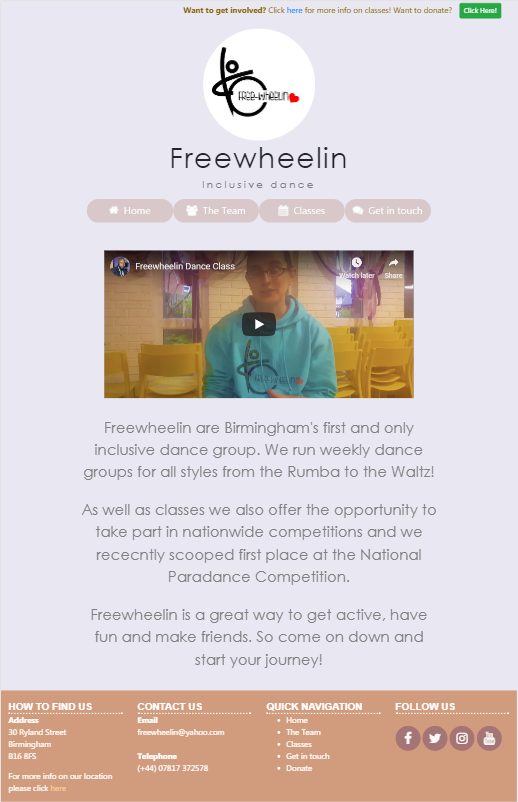

# Freewheelin website

## Stream 1 Mileston Project - User Centric Frontend Development - Code Institute

This is a website for a local inclusive dance company. The website provides information regarding all aspects of Freewheelin from staff and class times to contact details and donations, thus 
making it a useful tool to demonstate the many tools and skills I have picked up so far on the course.

## Demo

A live demo of the website can be found [here](https://francisillingworth.github.io/milestone-project-1/index.html)\

## UX

The goal of my design was to create a welcoming website with the primary goal of attracting new members to the dance company.
To do this I have created a minimalist design where each page contains small amounts of the most important information.
The idea behind this was to not overload the visitor and put them at a sense of ease.
This thought process also translated into all aspects of the page. Elements are all rounded not just to feel
fun but also to be neutral and welcoming as opposed to harsh baxes with sharp boxes (you will notice only the youtube clip on the .
\
One of t

